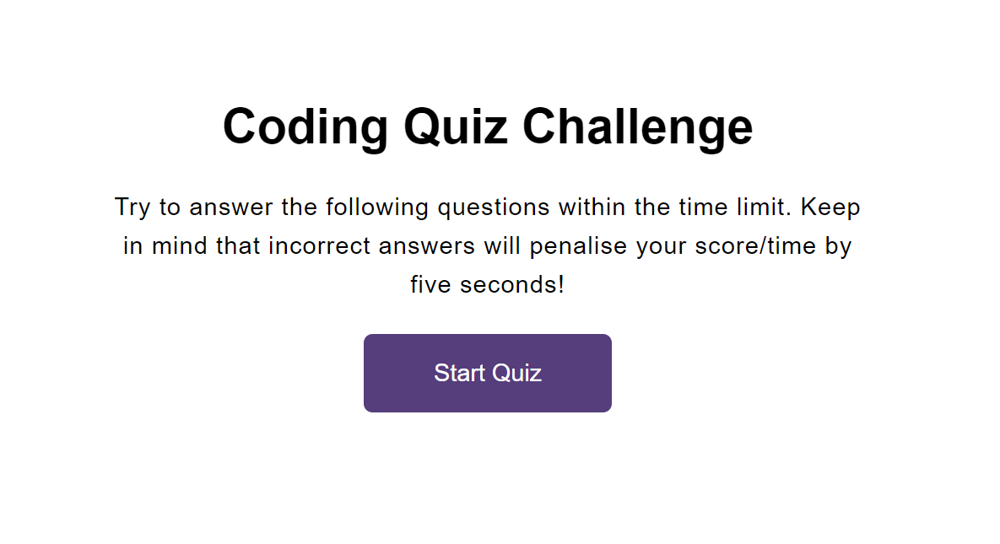

# Coding Quiz

## Description

- Another simple(ish!) Javascript app, looping through a few interesting questions.

- This app uses DOM manipulation to create, change or remove elements within document window.

- With User input, questions are displayed and looped through until either the timer ends or all questions are answered.

- At the end of the game, the user is able to input their initials and store their result to local storage.

## Installation

N/A

## Usage

Press start to begin the game! Don't forget to submit your score :)

## Credits

- The Bootcamp lot
- Wes Bos
- WS3 Schools
- https://developer.mozilla.org/

## License

MIT License

## Link

- https://github.com/nattytatat/coding-quiz

- https://nattytatat.github.io/coding-quiz